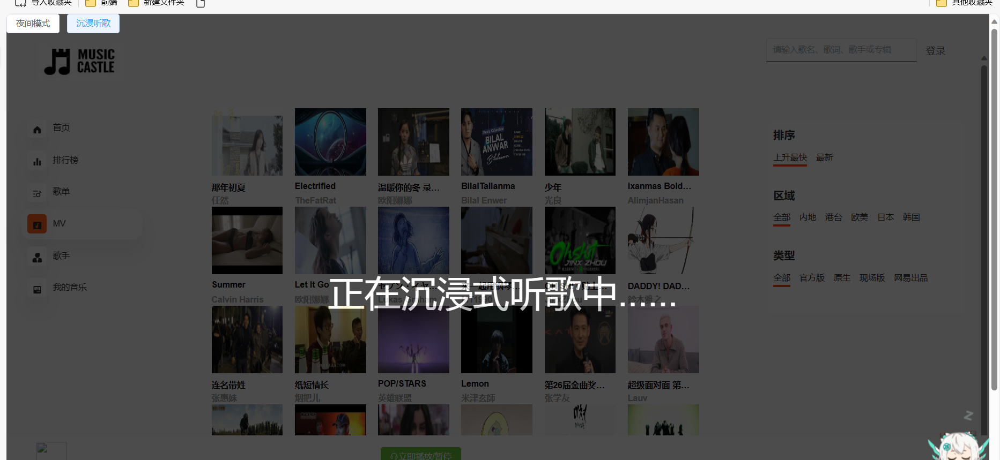

### 项目描述：

本项目名为 "音乐城堡"，一个专注于音乐和视频内容的网站。我们的网站提供了一个独特的、用户友
好的界面，让用户能够浏览和欣赏各种类型的音乐，包括歌曲、MV 以及排行榜上的热门曲目。
负责整个项目前端生产环境的整体搭建,仓库创建、项目搭建、项目上线。
对项目进行性能优化，成功将网站的 首屏加载时间（FCP）从 3.1 秒缩短至 0.8 秒，速度指数（Speed
Index）从 4.4 秒降低到 1.3 秒，最大内容绘制时间（LCP）从 7.0 秒减少到 1.8 秒，显提升了网站的整体性能
和用户体验。
音乐搜索框使用防抖函数，减少过多请求。
使用 Hooks 封装前端主题，实现黑暗模式切换效果。
根据歌曲的播放时间，结合 Web Audio API 实现了歌词与歌曲播放的同步滚动。

## 技术栈
``Vue3`` ``TypeScript`` ``Element Plus`` ``pinia`` ``vue3-video-play``

## Project Setup

```sh
npm install
```

### Compile and Hot-Reload for Development

```sh
npm run dev
```

# 网易云音乐

### 介绍

根据网易云音乐官方提供 node.js 的接口文档来完成网易云音乐网页版。

## 演示地址： http://1.94.195.239/

## 项目页面：

### 1.首页



### 2.歌曲


共 7 个页面，包括首页、rank 排行榜、歌单、歌手、Mv、Mv 详情页面、歌曲详情页面。

#### 夜间模式和沉浸模式

支持夜间和沉浸模式

